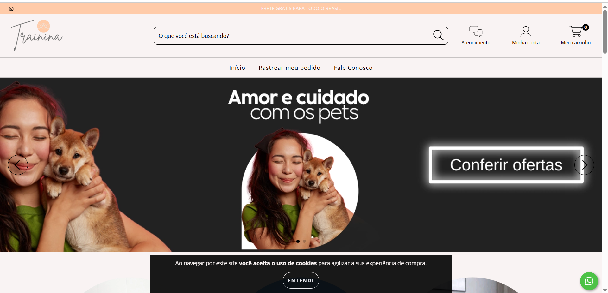
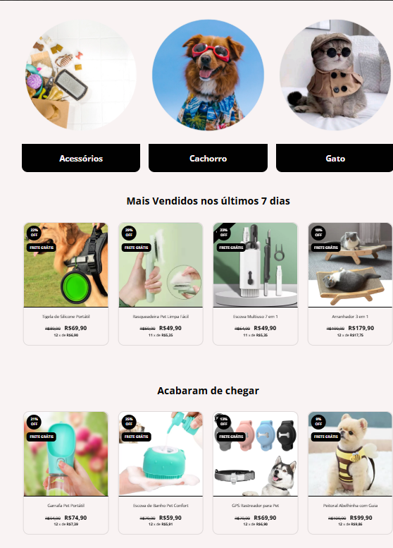

# pet-ecommerce
Projeto de e-commerce com Nuvemshop, identidade visual e catálogo de produtos 🐾
## 🛒 Loja Virtual Pet (Nuvemshop)

Estruturei uma loja virtual completa utilizando a plataforma **Nuvemshop**, com foco em **UX, identidade visual e estratégias de conversão**.

### 🚀 Funcionalidades
- [x] Catálogo de produtos organizado  
- [x] Checkout integrado  
- [x] Configuração de meios de pagamento (Mercado Pago / PagSeguro)  
- [x] Estratégias de recuperação de carrinho  
- [x] Personalização de layout e SEO básico  

### 🔧 Tecnologias & Ferramentas
- Nuvemshop
- HTML/CSS (customizações)
- Google Analytics
- SEO & UX

## 📸 Impressões da Loja

  
  

### 🌎 Acesse a loja
👉 [Link para a loja publicada](https://trainina.lojavirtualnuvem.com.br/) 
